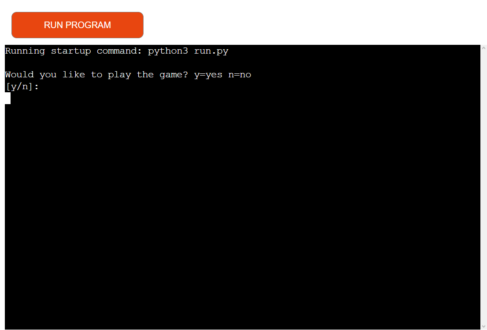
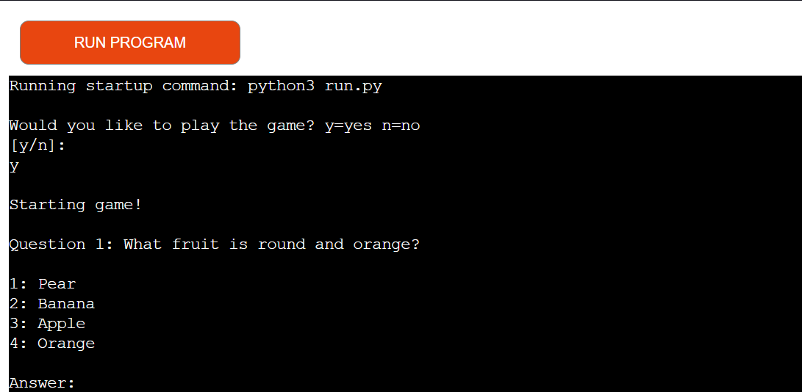
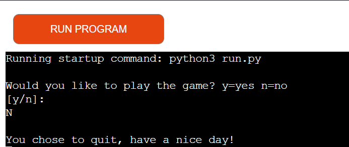
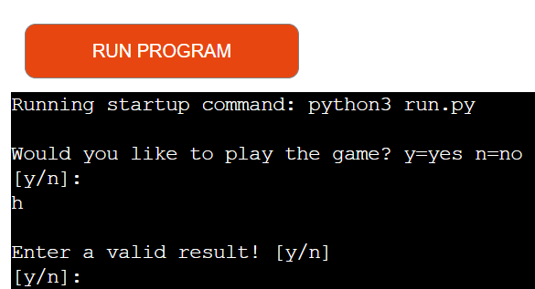
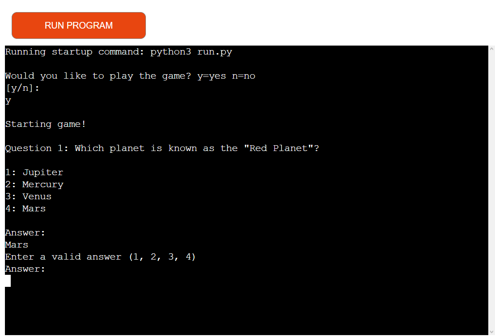
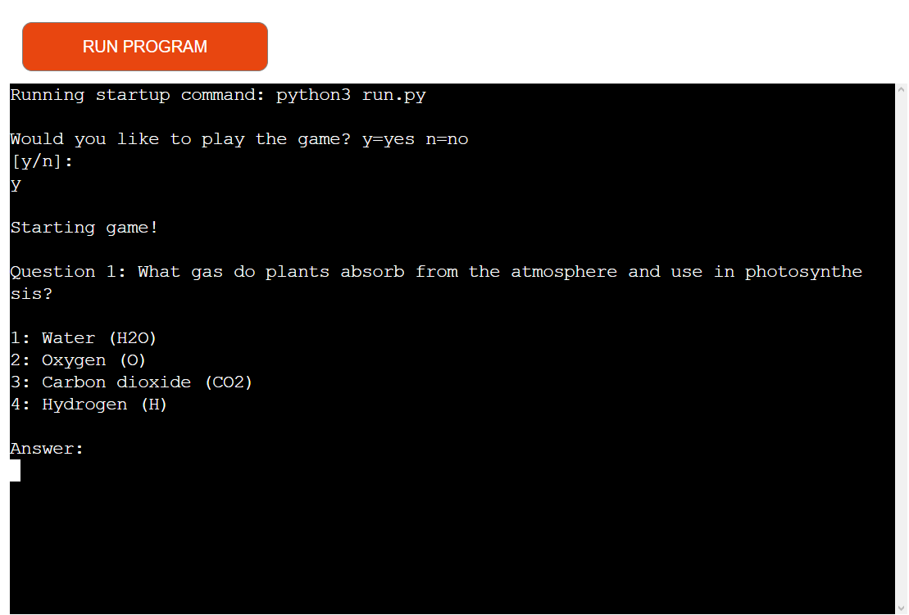
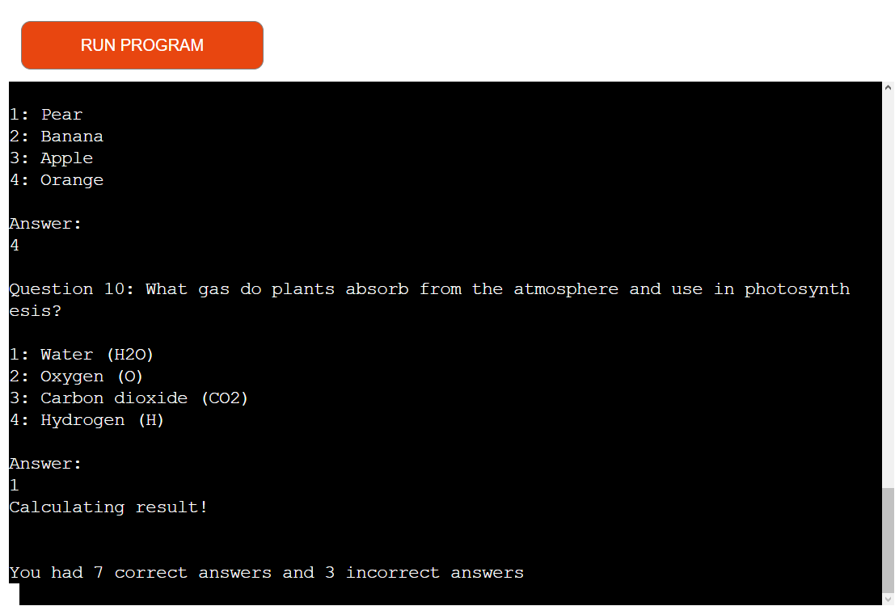

# Quiz game App!

This is a terminal based quiz game made for people who wish to play a simple quiz game. It is designed to be a fun game experiance and to also be a learning experiance for the user. The game selects ten random questions and takes an input from the user. It then calculates how many answers were correct and incorrect and displays it to the user.

Some use cases for this app includes:  
It can be used in for example, schools who want to have an easy and fun way to check how much the students know about a subject.  
Or if one writes a specific list of questions, it could also be used by students, who wish to quiz themselves about topics on upcoming tests.  

----------

## Features

### Start screen:
  
When the user runs the program, they are met with a message that asks whether the user wishes to start the game. This is so that the user can choose to play the game or not. Once the user has clicked _Run Program_, the user can enter either y or n (uppercase letters or spaces does not matter), where they can start the game or quit.

#### Input Y or y

If the user writes y as the answer, they are met with a message saying "Starting game!", and the first question out of ten will be shown, which means the game has started.

#### Input N or n

  
If the user writes n as the answer, they will be met with a message that says "You chose to quit, have a nice day!". This means that the game has not started and nothing more will be loaded.

### Invalid input:

#### Example: Start input

  
On the start screen the user can only answer y or n (uppercase letters or spaces does not matter). When an invalid input is given, the terminal will respond with: "Enter a valid result! [y/n]". This gives the user another chance to answer whether they wish to play the game or quit, in the case that they entered the wrong input.  
This will be repeated until the user enters a valid input.

#### Example: Answer input

  
Appart from the start screen. The user can only give four answers during the course of the game, the numbers 1, 2, 3 or 4. When an invalid input is given, the terminal will respond with: "Enter a valid answer (1, 2, 3, 4)", and will allow the player to enter an number.  
This will be repeated until the user enters a valid input.

### Random questions:

  
The game has a list of questions, and answers to those questions. It can select a set of 10 random questions from this list and displayes them in a random sequence, where the user can then give their answer.

### Answer calculation:

  
When the user has completed the game by answering all the questions. The game will calculate how many of the questions had the correct and incorrect answers given. This helps the user try and figure out what they got wrong, and can play the game again to get more correct answers.

### Possible features:

* API connection to a Google Form so that questions and answers can be submitted which gives more variation to questions asked, or can make it usefull in other cases eg. studying for exams.
* Game asks user if they wish to restart the game once it is over
* Game asks if user wants to play the game once n has been given so as to not have to rerun the program

----------

## Testing

### Browser testing:

The game has been tested on different web browsers such ass oprah, chrome, edge etc. The game works as it should and functions the same on all of them. All calculations, messages and functions work and diplay as they should

### Bugs:

* ~~Correct/Incorrect answers calculation does not work properly~~
* ~~All messages do not display as they should~~

### Fixed bugs:

* Correct/Incorrect answers calculation now calculates correctly
* All messages are shown in sequence with the games progression

----------

## Attributions

### Credits:

* Code written in the python "run" file and all screenshots were made by me
* All other files were provided by Code Institute

----------

## Deployment

* The deployment process was as follows using Heroku:
  * Create a new app
  * Navigate to the settings tab
  * Add python and nodejs buildpacks
  * Navigate to the deploy tab
  * Choose the GitHub deployment method, and connect to the github repository
  * On the deploy tab make sure that the selected branch is main
  * Click deploy branch and the Site becomes live: [Heroku Quiz game link](https://my-python-quiz-game-01ad349deb74.herokuapp.com)